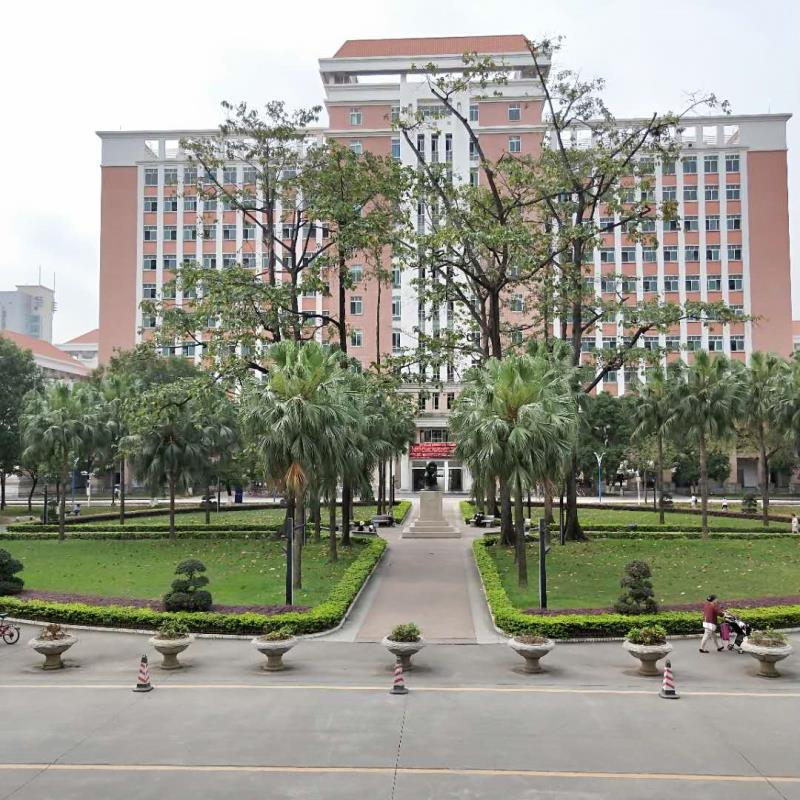
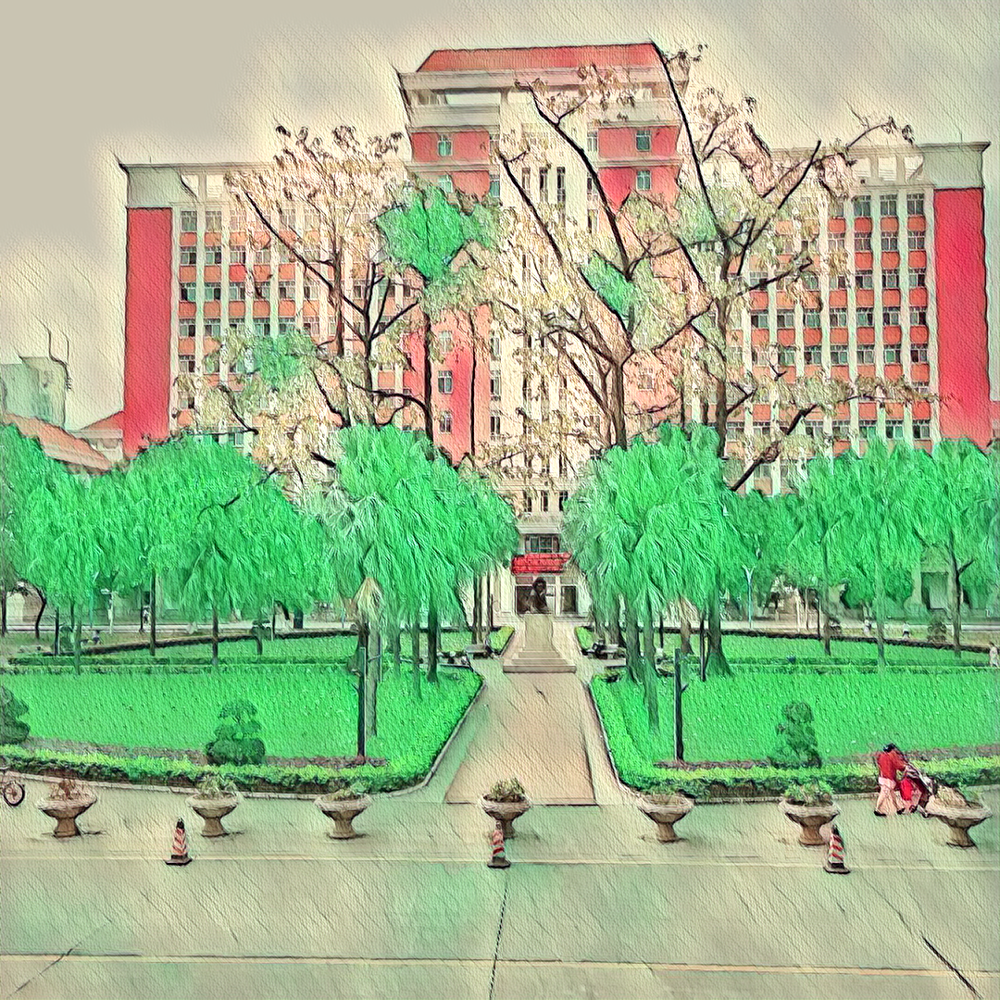
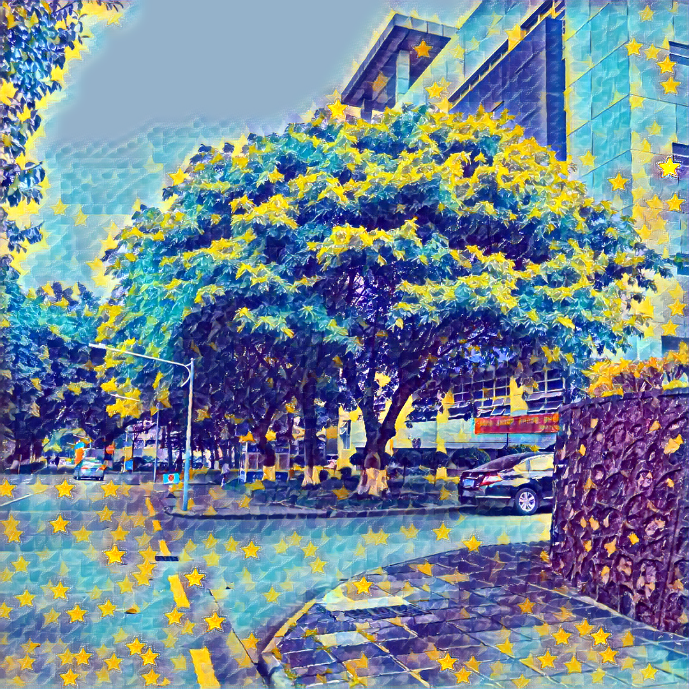
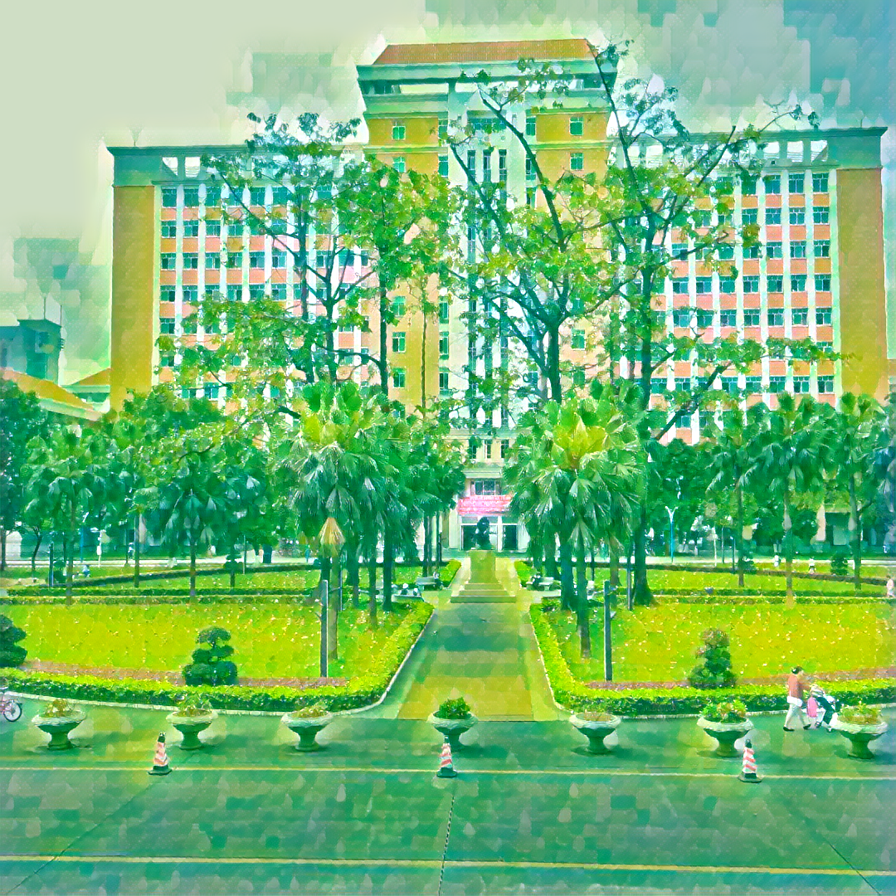

# fast-neural-style-transfer
用pytorch实现的快速风格迁移

快速风格迁移
```
python neural_style/neural_style.py eval --content-image </path/to/content/image> --model </path/to/saved/model> --output-image </path/to/output/image> --cuda 0
```
* `--content-image`: path to content image you want to stylize.
* `--model`: saved model to be used for stylizing the image (eg: `mosaic.pth`)
* `--output-image`: path for saving the output image.
* `--content-scale`: factor for scaling down the content image if memory is an issue (eg: value of 2 will halve the height and width of content-image)
* `--cuda`: set it to 1 for running on GPU, 0 for CPU.

<p align="center">
    
    
    
</p>

训练模型
```bash
python neural_style/neural_style.py train --dataset </path/to/train-dataset> --style-image </path/to/style/image> --save-model-dir </path/to/save-model/folder> --epochs 2 --cuda 1
```

There are several command line arguments, the important ones are listed below
* `--dataset`: path to training dataset, the path should point to a folder containing another folder with all the training images. I used COCO 2014 Training images dataset [80K/13GB] [(download)](http://mscoco.org/dataset/#download).
* `--style-image`: path to style-image.
* `--save-model-dir`: path to folder where trained model will be saved.
* `--cuda`: set it to 1 for running on GPU, 0 for CPU.

<p align="center">
  
  
  <br>
  
  
</p>
